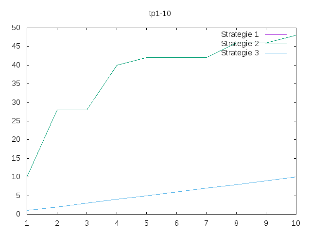

---------------
Experimentateur
---------------

.. toctree::
   :maxdepth: 1

   experience.rst
   sorting.rst
   test.rst

~~~~~~~~~~
Etat du TP
~~~~~~~~~~

Nous pensons avoirs un problème dans la fonction de l'écriture de données (file(n,name_file) cf test.py) pour la strategy 3, faussant si c'est le cas les courbes.

(Les valeurs 'op' de la STRATEGY 1 et STRATEGY 3 sont égaux lors de negative_markers(markers,positive) avec len(markers) = 10)

Nous n'avons pas eu le temps afin de commenter les courbes.

~~~~~~~~~~~~~~~~~~~~~~
Réponses aux questions
~~~~~~~~~~~~~~~~~~~~~~

~~~~~~~~~~~~
Stratégie 1
~~~~~~~~~~~~

Question 1

cf test.py

Question 2

Nous proposons de compter le nombre d'opérations effectuer dans la vérification de compare(element de markers, element de positive) == 0

Question 3

Il n'existe pas de pire des cas.
Pour m marqueur(s) négatif(s), nous sommes obligés de parcourir tous les positifs, soit (m-p)*p comparaisons.

Il existe 1 marqueur positif qui sera en position 0 dans la liste des positifs, soit 1 comparaison

Il existe 1 marqueur positif qui sera en position 0 dans la liste des positifs, soit 2 comparaisons

Il existe 1 marqueur positif qui sera en position 0 dans la liste des positifs, soit 3 comparaisons

...

Il existe 1 marqueur positif qui sera en position p-1 dans la liste des positifs, soit p comparaisons

Soit p(p+1)/2

Question 4

On à donc:
c1(m,p) = (m-p)*p + (p(p+1)/2)

~~~~~~~~~~~~
Stratégie 2
~~~~~~~~~~~~

Question 1

cf test.py

Question 2

Pour le tri : Dans le pire des cas, le tableau est dans l'ordre decroissant, on a alors p(p+1)/2 comparaisons.

Pour la recherche dichotomique, on a:

c2(m,p) = p*log(p)

~~~~~~~~~~~~
Stratégie 3
~~~~~~~~~~~~

Question 1

cf test.py

Question 2

Pour les tris : Dans le pire des cas on a ( p(p+1) + m(m+1) )/2 comparaisons. Pour les tris : Dans le pire des cas on a ( p(p+1) + m(m+1) )

Pour la recherche de l'élément dns le pire des cas on ne fait que m+p comparaisons au maximum (dans le cas ou le plus grands des marqueurs est positif).
Mais si le plus grand marqueur positif est l'avant dernier marqueur par exemple on aura m+p-1 comparaisons.
On trouve donc une born superieure de :
c3(m,p) < p(p+1)/2 + m(m+1)/2 + m+p

~~~~~~~~~~~~~~~~~~~~~~~~~~~~~~~~~~~~~~~~~~
Recherches empiriques des cas favorables
~~~~~~~~~~~~~~~~~~~~~~~~~~~~~~~~~~~~~~~~~~

Question 1

Nous mettons dans la focntion compare() dans test.py, cpt += 1

Question 2

/!\ Nous avons de mauvais résultats 'op' pour la STRATEGY 3  /!\

Question 3

Question 4

cf test.py (et cf file.py)

Question 5

Question 6

.. image:: ../src/images/tp1-100.png
