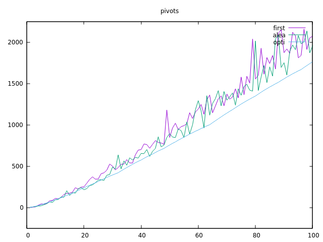

---------
Quicksort
---------

.. toctree::
   :maxdepth: 1

   modules.rst

~~~~~~~~~~
Etat du TP
~~~~~~~~~~

Problème lorsque l'on remplace les comparaisons faites lors du calcul du pivot optimal par la fonction cmp

~~~~~~~~~~~~~~~~~~~~~~
Réponses aux questions
~~~~~~~~~~~~~~~~~~~~~~

Pivot premier élément:

Question 1 :
 On peut citer comme exemple, le tri bulle, le tri insertion ou encore le tri fusion

Question 2:
cf sorting.py

Question 3:
pour que le partitionnement soit correctement réalisé il faut:
	-que les éléments soient comparable
	-une fonction de comparaison

Question 4:
cf sorting.py

Question 5
cf sorting.py

Question 6:
cf sorting .py

Question 7:
cf sorting.py

Question 8:
Nous utilisons 4 espaces mémoires supplémentaires : pivot, idx, aux et count

Pivot aléatoire:

Question 1:
cf sorting.py

Question 2:
cf sorting.py

Question 3:
cf sorting.py

Question 4:
cf first_100.dat
cf alea_100.dat
Il n'y a pas beacoup de différence

Question 5:

la compléxité est :Θ(n**2)

 Pivot optimal:

Question 1:
Théoriquement la valeur optimale serait la valeur médiane de la tranche.

Question 2:
cf sorting.py

Question 3:

Question 4:
ON peut conclure que sur une liste de 100 tableaux, le pivot optimal est le meilleur pivot que l'ont doit utiliser pour avoir le moins de comparaison

Question 5
la compléxité est en Θ(n log n)

Pivot réellement optimal ?

Question 1:
le pivot n'est plus aussi optimal 

