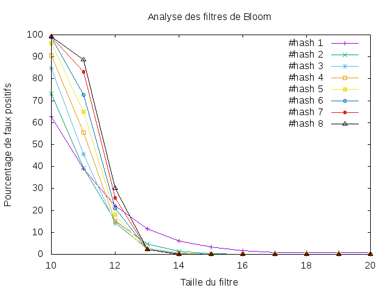

---------------
 tp-bloom
---------------

.. toctree::
   :maxdepth: 1

   bloomfilter.rst
   hashs.rst

~~~~~~~~~~
Etat du TP
~~~~~~~~~~

TP fini.

Pour faire la courbe, vous pouvez utiliser la commande "make courbe" dans le dossier src.

Pour voir le temps d'éxécution, vous pouvez utiliser la commande "make tim" dans le dossier src.

- 16 mars 2017 : 34s

Nous n'avons pas réussi à diminuer le temps d'éxécution.

~~~~~~~~~~~~~~~~~
Commande makefile
~~~~~~~~~~~~~~~~~

Ce placer dans le dossier et vous pouvez éxécuté ces commandes dans le terminal afin de créer les courbes (qui se trouvera dans le dossier src) ou de regarder le temps d'éxécution.

==> make courbe :
  - python3 test.py > res.txt
  - gnuplot < tp-bloom.plt

==> make tim :
  - time python3 test.py > res.txt

~~~~~~~~~~~~~~~~~~~~~~
Réponses aux questions
~~~~~~~~~~~~~~~~~~~~~~

4.1 Fonctions de hachage d'une chaine de caractères
----------------------------------------------------

q1) cf test.py : code_of_string

4.2 Le module bloomfilter
-------------------------

q1) cf bloomfilter.py : create, add, contains

q2) python3 test.py

Exemple :

Test add
timoleon est present

Test random
BGHhvVhN n'est pas present

q3) A partir d'une taille de filtre valant 3, on commence à tirer des mots au hasard présents.

4.3 L'analyse des faux positis
-------------------------------

q1) cf test.py : analyse()

q2) cf res.txt

q3) cf sourcedoc/tp4.png

q4)

.. toctree::
   :maxdepth: 1

Nous pouvons voir que pour une taille de filtre variant de 10 à 20 :

  - Exemple :

    - Pour la table de hachage 1, pour une taille de filtre valant 10, le taux de faux positif vaut environ 60.
    - Pour la table de hachage 1, pour une taille de filtre valant 20, le taux de faux positif vaut envrion moins de 3.

    - Pour la table de hachage 8, pour une taille de filtre valant 10, le taux de faux positif vaut environ 100.
    - Pour la table de hachage 8, pour une taille de filtre valant 20, le taux de faux positif vaut environ moins de 1.

=> CONCLUSION :

- Plus la taille du filtre est petit et plus le numéro de la table, fonction, de hachage est grand, plus le taux de faux positif est élevé.

- Plus la taille du filtre est grand et plus le numéro de la table, fonction, de hachage est grand, plus le taux de faux positif est faible.
