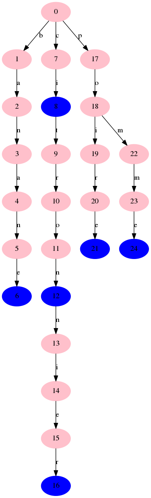
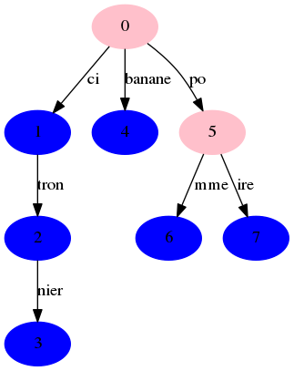

-----------------
tp-trie
-----------------

~~~~~~~~~~
Etat du TP
~~~~~~~~~~

Terminé

Nous avons ajouté une classe Main, "expliqué" dnas la partie Classe suplémentaire.

~~~~~~~~~
Commandes
~~~~~~~~~

Ce placer dans le dossier src-java, puis utilisez les commandes, vous pouvez éxécuter la commande make tp afin de réaliser les 3 commandes (trie, dc, compileTest) :
  - make trie, pour compiler les classes permettant de répondre au tp
  - make dc, pour compiler la documentation des classes
  - make compileTest, pour compiler les tests
  - make testo, pour éxécuter la commande compileTest, puis éxécuter les tests
  - make TrieMain, pour éxécuter la classe TrieMain
  - make CompactTrieMain, pour éxécuter la classe CompactTrieMain
  - make Main, pour éxécuter la classe Main
  - make png, pour créer les images des arbres (liés à trie, et à compactTrie)

~~~~~~~~~~~~~~~~~~~~~~
Réponses aux questions
~~~~~~~~~~~~~~~~~~~~~~

6.1 Construction d'un trie
--------------------------

Q1) On utilise TreeMap<Character, new Trie()> comme structure de donnée.

q2) banane : map => {b,{a,{n,{a,{n,{e,{}}}}}}}

q3) C'est un noeud sans fils
    cf Trie.java

6.2 Ajouts de mots dans le trie
-------------------------------

cf. Trie.java

6.3 Affichage d'un trie
-----------------------

cf. Trie.java

.. toctree::
   :maxdepth: 1

6.4 Version compactée d'un trie
-------------------------------

cf. CompactTrie.java

.. toctree::
   :maxdepth: 1

Classe supplémentaire
---------------------

Nous avons réalisé une classe supplémentaire, permettant de tester trie, et compactTrie.

En éxécutant make Main, vous aurez différentes possibilitées:
  - T : pour "éxécuter" TrieMain
  - C : pour "éxécuter" CompactTrieMain
  - D : pour "éxécuter" TrieMain et CompactTrieMain
  - MT : où vous choissirez le nombre de mots à ajouter, puis vous les donnerez
  - MC : où vous choissirez le nombre de mots à ajouter, puis vous les donnerez
  - Ou rien, et cela arrêtera l'éxécution
